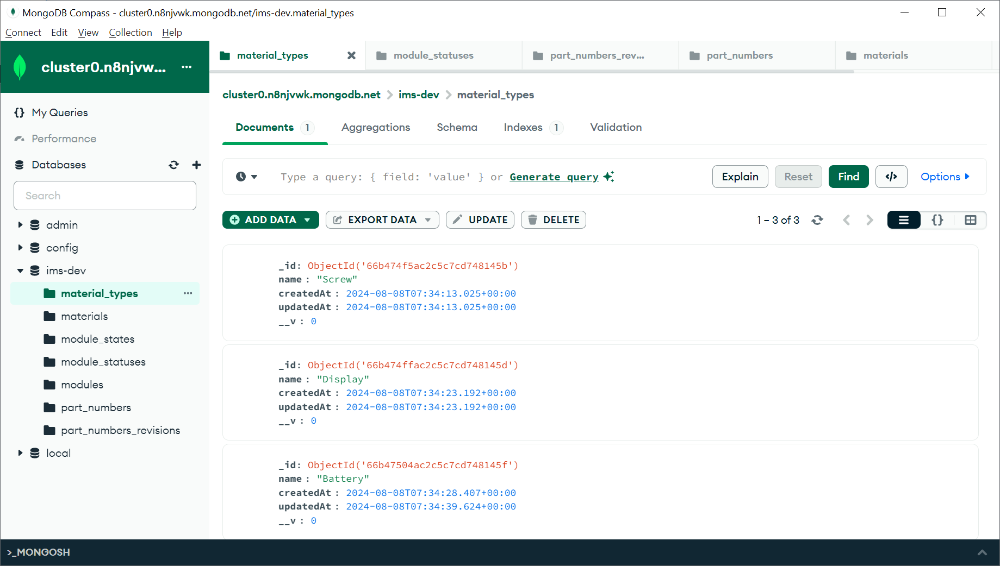

# Welcome to Inventory Management System

## UI
- ### Main Screen - List of Materials
  

- ### Main Screen - Left Side Bar is open
  
  
- ### Material Types List
  

- ### Add New Material Type
  

- ### Add New Material
  

- ### Materials Filter
  

- ### Filtered Materials
  

- ### Part Numbers
  

- ### Add New Part Number
  

- ### Revision of Part Numbers
  

- ### Add New Revision
  

## Database Structure in MongoDB

- ### Material Types

  

- ### Materials

  

- #### Part Number of Material

  

- #### Revision of Part Number

  

- ### Modules - TBD
<!--

- #### Status of Module - On Shelf / Assembled / Obsolete

  

- #### State of Module - Released / Development

  

- #### Serial Number of Module

  

- #### Module
  
-->
